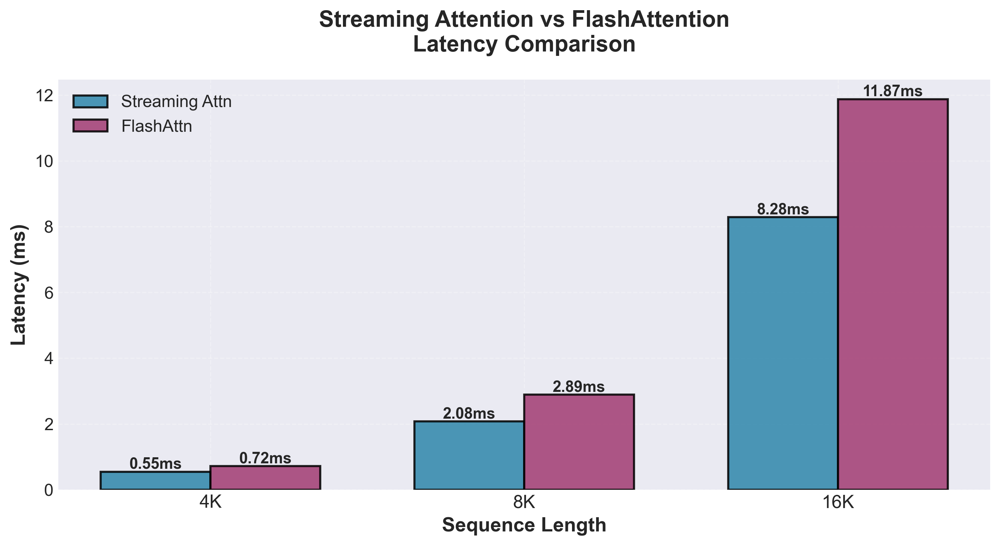

# Light-DuoAttention

A lightweight CuTe-based CUDA kernel for DuoAttention, optimized for large language model inference.

## Demo

The video below demonstrates Light-DuoAttention in action within the sglang. We replaced the standard prefill attention(during `forward_extend`) with our kernel and ran the classic "Needle in a Haystack" (NIAH) test.

https://github.com/user-attachments/assets/1c07508d-da90-4e5c-91f7-53fa3a976003


## Overview

`Light-DuoAttention` provides a lightweight CUDA kernel for **DuoAttention**. This attention mechanism is a hybrid approach designed for efficient long-context processing. 
Unlike standard attention where all heads behave identically, DuoAttention employs two distinct types of heads:

1.  **Retrieval Heads**: These heads perform **Full Attention** over the entire sequence (or a large chunk), allowing them to capture rich, long-range dependencies and act as a powerful information retrieval component.
2.  **Streaming Heads**: These heads use **Streaming Attention**, processing tokens in a sliding-window or fixed-cache manner. They are highly efficient and ideal for handling very long sequences while maintaining local context.

This hybrid approach allows a model to balance expressive power with computational efficiency. 
This kernel is implemented using CuTeDSL, the core of CUTLASS 4.x, enabling a clean and optimized implementation of this complex logic.

## Installation

```bash
pip install -e .
```

**Note**: This kernel requires NVIDIA Hopper (SM 9.0) or newer GPUs.

## Quick Start

### Basic Streaming Attention

```python
import torch
import math
from light_duo_attn.kernels import streaming_sparse_attn_func

device = torch.device("cuda")
batch_size, seqlen, num_heads, head_dim = 1, 2048, 32, 128
dtype = torch.bfloat16

# Create input tensors
q = torch.randn(batch_size, seqlen, num_heads, head_dim, dtype=dtype, device=device)
k = torch.randn(batch_size, seqlen, num_heads, head_dim, dtype=dtype, device=device)
v = torch.randn(batch_size, seqlen, num_heads, head_dim, dtype=dtype, device=device)

# Run streaming attention
output, lse = streaming_sparse_attn_func(
    q, k, v,
    softmax_scale=1.0 / math.sqrt(head_dim),
    causal=True,
    window_size=(31, 0),  # local window size
    sink_size=4,           # number of sink tokens
    enable_streaming=True,
)

print(f"Output shape: {output.shape}")  # [1, 2048, 32, 128]
```

### Model Weight Reordering for DuoAttention

To use DuoAttention with your model, you need to reorder the attention weights so that retrieval (full attention) heads and streaming heads are grouped together:

```python
import torch
from transformers import AutoModelForCausalLM
from light_duo_attn import reorder_weights_for_duo_attn

# Load your model
model = AutoModelForCausalLM.from_pretrained(
    "meta-llama/Llama-2-7b-hf",
    torch_dtype=torch.bfloat16,
    device_map="auto",
)

# Define which heads should be full attention vs streaming
# For example: first 25% of KV heads are full attention
num_kv_heads = model.config.num_key_value_heads
num_full = num_kv_heads // 4
pattern = [1] * num_full + [0] * (num_kv_heads - num_full)
full_attention_heads = [pattern] * model.config.num_hidden_layers

# Apply weight reordering
duo_attn_config = reorder_weights_for_duo_attn(
    model=model,
    full_attention_heads=full_attention_heads,
    sink_size=4,
    recent_size=256,
    num_attention_heads=model.config.num_attention_heads,
    num_key_value_heads=model.config.num_key_value_heads,
    hidden_size=model.config.hidden_size,
)

# Now the model is ready for DuoAttention inference!
# Use duo_attn_config to configure your attention computation
```


## Testing

Run the test suite to verify the implementation:

```bash
# Run 
pytest tests/test_streaming_attention.py::test_streaming_attention
# Run specific test
pytest tests/test_streaming_attention.py -v
```

## Benchmarking

We provide benchmarking tools to compare Streaming Attention with FlashAttention.

### Quick Benchmark

```bash
cd benchmarks

# Run with default settings
python bench_attention.py

# Custom configuration
python bench_attention.py \
    --batch-sizes 1 2 4 \
    --seqlens 8192 16384 \
    --num-heads 32 \
    --head-dim 128 \
    --recent-size 256 \
    --sink-size 128
```

### Key Parameters

- `--recent-size`: Size of the recent token window (default: 256)
- `--sink-size`: Number of initial sink tokens to always attend to (default: 128)
- `--num-warmup`: Warmup iterations for stable measurements (default: 5)
- `--num-iters`: Benchmark iterations for averaging (default: 50)

<p align="center">
<br>
Figure 1. Performance comparison of FlashAttention and Streaming Attention. Sink size: 128, Recent size: 256.
</p>

Note: Additional benchmarks are planned for future releases, including both low-level kernel performance evaluation and end-to-end model inference benchmarking. These comprehensive performance assessments will provide deeper insight into the efficiency and practical impact of Light-DuoAttention in real-world scenarios. Please stay tuned for upcoming tools and results.


